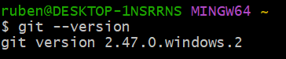
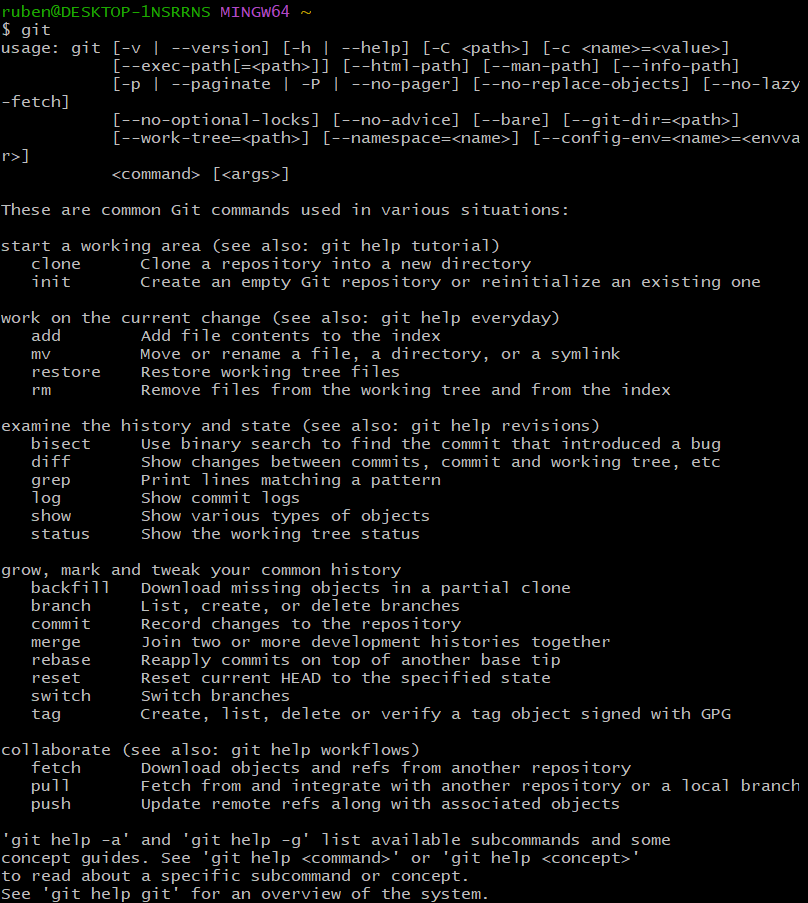
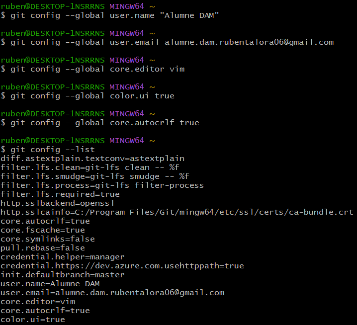
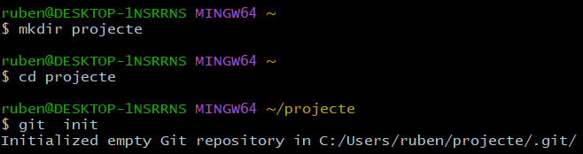
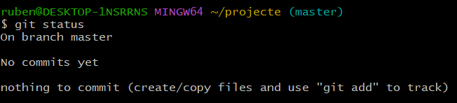
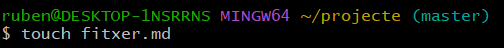
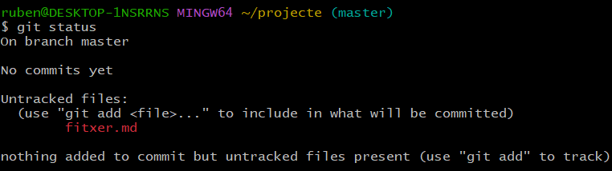
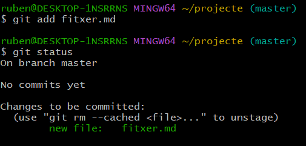
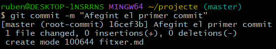
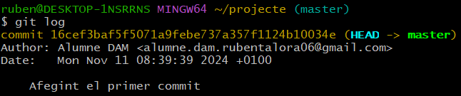

El sistema de control de versiones distribuido git
=

## Comprobando la versión

Para saber qué versión tenemos instalada utilizaremos:

``$ git --version``

## Consultando la ayuda

Si escribimos desde la consola el orden git, se nos mostrará una ayuda:

``$ git``

## Configurando git

Vemos a continuación los diferentes parámetros a configurar en git y cómo hacerlo:

- Identidad del usuario, que se compone del nombre y el correo electrónico:

    - ``$ git config --global user.name "Alumne DAM"``

    - ``$ git config --global user.email alumne.dam.ieseljust@gmail.com``

- Editor predeterminado para cuando git necesite que escribamos algún mensaje (por ejemplo el mensaje de cada commit):

    - ``$ git config --global core.editor vim``

También existen otros elementos a configurar que nos pueden ser de utilidad:

- Para que utilice la salida en colores significativos:

    ``$ git config --global color.ui true``

- Para indicar a git que realice conversiones entre finales de línea cuando trabajamos en entornos híbridos Linux / Windows / Mac:

    ``$ git config --global core.autocrlf true``

- Si queremos consultar toda la lista de parámetros, haremos:

    ``$ git config --list``

## Començant a treballar amb repositoris

Creación e inicialización de la carpeta del proyecto

- Nos situamos en la terminal en el directorio donde guardaremos los proyectos, y creamos la carpeta del proyecto con:

    ``$ mkdir projecte``

- Ahora nos ubicamos dentro de él:

    ``$ cd projecte``

- E inicializamos ahí el repositorio:

    ``$ git init``

- Si queremos ver el estado del repositorio haremos:

    ``$ git status``

Creación de contenido

- Ahora crearemos un fichero nuevo, mediante el orden ``touch``. 

    ``$ touch fitxer.md``

- Observamos el estado de git:

    ``$ git status``

Haciendo el seguimiento del archivo

- Para hacer el seguimiento del archivo en el sistema de control de versiones:

    ``$ git add fitxer1.md``

- Consultamos el estado del repositorio:

    ``$ git status``

Haciendo el commit del fichero

- Para añadir el fichero en el repositorio:

    ``$ git commit -m "Afegint el primer commit"``

- También podemos ver un registro de los commits con el orden:

    ``$ git log``  

 

